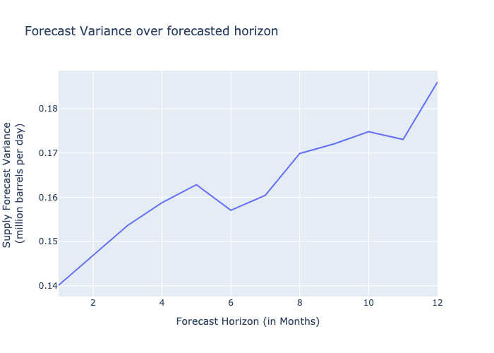
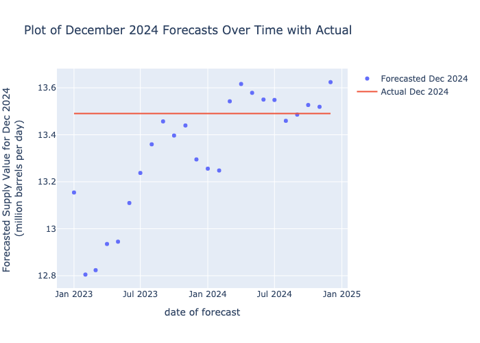
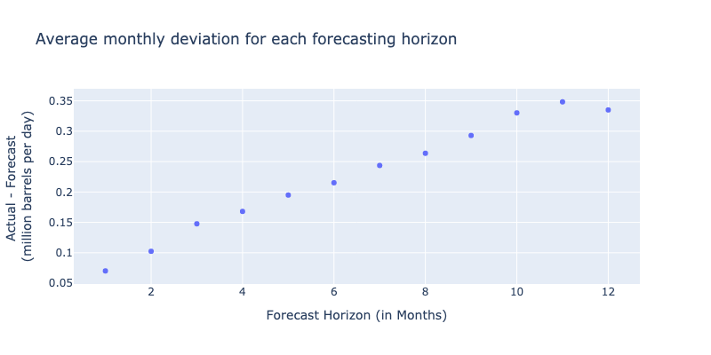
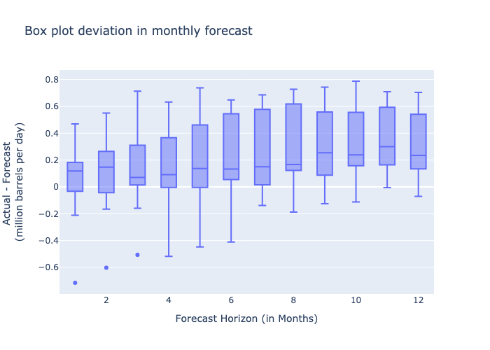
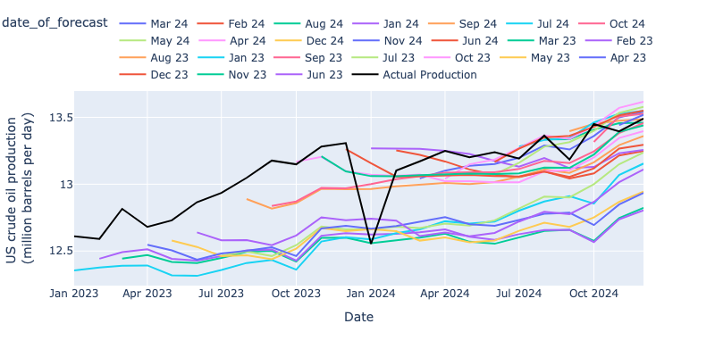

# EIA Data Analysis Assignments

## Assignment 1: STEO Data Analysis

### Downloading Data
```
cd assignment_part1
python download_EIA_data.py
```
Data Source: [EIA STEO Outlook](https://www.eia.gov/outlooks/steo/outlook.php)<br>
The function ```save_excel_files``` takes input argument ```years``` a list of years to download mentioned year's data.The downloaded data is stored in ```EIA_Excel_Files``` folder.

## Preprocessing
```python preprocess_EIA_data.py```<br>
```preprocess_EIA_data.py``` reads all downloaded files present in ```EIA_Excel_Files``` folder and save them into ```processed``` folder. Processed data has columns ds (as date), values, and a 0/1 flag to know if the data is forecast (1) or actual (0).<br>
Sample of Processed data:
| ds (date) | values| flag (0=actual, 1=forecast) |
| ------- | ------- | ------- |
| 2023-01-01 | xx | 0 |
| 2023-02-01 | xx | 1 |
| 2023-03-01 | xx | 1 |

## Analysis & Visualization
Jupyter notebook file 
```analysis_EIA_data.ipynb``` 
contains full analysis with plots (also a pdf version of the same ```.ipynb``` is added to the github repo for viewing embedded plots without running code).

## Key Findings:

### Highlights of analysis
 <br>
**Above Image shows that the variance increases with forecast horizon**
<br>
 <br>
**Image shows the Plot of December 2024 Forecasts Over Time with Actual value.**

### Range of deviation for dec 2024 forecast
| Min | Max| Mean | Median | Actual value |
| ------- | ------- | ------- |------- |------- |
| 12.80489 | 13.62401| 13.3296 | 13.41812 | 13.490543 |

### Average monthly Deviation: 0.226 (million barrels per day)
 <br>
Plot shows Average monthly deviation for each forecasting horizon and the deviation increases with forecast horizon.

### boxplot of monthly deviation for each forecast horizon
 <br>
Above image shows the boxplot of monthly deviation with varying forecast horizon.

### Line plot showing each forecasting iteration
 <br>
<br><br>
And the './summary_table.csv' shows the overall summary in a tabular format with dates as (Jan 23, Feb 23.. format) 

| ****             | **forecast** | **forecast** | **forecast** | **forecast** | **forecast** | **forecast** | **forecast** | **forecast** | **forecast** | **forecast** | **forecast** | **forecast** | **forecast** | **forecast** | **forecast** | **forecast** | **forecast** | **forecast** | **forecast** | **forecast** | **forecast** | **forecast** | **forecast** | **forecast** |
|------------------|--------------|--------------|--------------|--------------|--------------|--------------|--------------|--------------|--------------|--------------|--------------|--------------|--------------|--------------|--------------|--------------|--------------|--------------|--------------|--------------|--------------|--------------|--------------|--------------|
| ds               | Jan 23       | Feb 23       | Mar 23       | Apr 23       | May 23       | Jun 23       | Jul 23       | Aug 23       | Sep 23       | Oct 23       | Nov 23       | Dec 23       | Jan 24       | Feb 24       | Mar 24       | Apr 24       | May 24       | Jun 24       | Jul 24       | Aug 24       | Sep 24       | Oct 24       | Nov 24       | Dec 24       |
| date_of_forecast |              |              |              |              |              |              |              |              |              |              |              |              |              |              |              |              |              |              |              |              |              |              |              |              |
| Jan 23           | 12.35465     | 12.37652     | 12.39013     | 12.39254     | 12.31802     | 12.31431     | 12.35787     | 12.41075     | 12.43362     | 12.36115     | 12.57146     | 12.60382     | 12.58701     | 12.63427     | 12.66222     | 12.72288     | 12.70548     | 12.71987     | 12.80203     | 12.87108     | 12.91022     | 12.85433     | 13.06834     | 13.15428     |
| Feb 23           |              | 12.44287     | 12.49125     | 12.51323     | 12.44225     | 12.42862     | 12.4614      | 12.50467     | 12.51103     | 12.42842     | 12.6148      | 12.63359     | 12.62401     | 12.62868     | 12.64007     | 12.66266     | 12.60659     | 12.58324     | 12.62624     | 12.65662     | 12.65853     | 12.56703     | 12.73754     | 12.80489     |
| Mar 23           |              |              | 12.4436      | 12.4703      | 12.41873     | 12.40987     | 12.44831     | 12.49393     | 12.50211     | 12.42159     | 12.59934     | 12.60029     | 12.55948     | 12.57776     | 12.59987     | 12.62953     | 12.56962     | 12.55461     | 12.60384     | 12.6509      | 12.65925     | 12.57546     | 12.74602     | 12.82365     |
| Apr 23           |              |              |              | 12.54748     | 12.50557     | 12.43605     | 12.4822      | 12.50211     | 12.52837     | 12.46255     | 12.6693      | 12.68914     | 12.66635     | 12.68751     | 12.7184      | 12.75319     | 12.70042     | 12.68838     | 12.73281     | 12.77885     | 12.7864      | 12.69427     | 12.84815     | 12.93507     |
| May 23           |              |              |              |              | 12.5783      | 12.53083     | 12.46168     | 12.46869     | 12.43823     | 12.51816     | 12.6716      | 12.64901     | 12.66314     | 12.64869     | 12.57789     | 12.60252     | 12.56572     | 12.57936     | 12.65128     | 12.7124      | 12.68087     | 12.75103     | 12.86757     | 12.94498     |
| Jun 23           |              |              |              |              |              | 12.63946     | 12.58028     | 12.58248     | 12.54381     | 12.61657     | 12.75253     | 12.73004     | 12.74145     | 12.72753     | 12.61201     | 12.63899     | 12.61096     | 12.63583     | 12.72078     | 12.79398     | 12.77607     | 12.86789     | 13.01466     | 13.10955     |
| Jul 23           |              |              |              |              |              |              | 12.4653      | 12.49745     | 12.46286     | 12.54392     | 12.6843      | 12.66216     | 12.66132     | 12.68161     | 12.67254     | 12.70474     | 12.69047     | 12.72971     | 12.81815     | 12.90671     | 12.90138     | 13.00032     | 13.14892     | 13.23741     |
| Aug 23           |              |              |              |              |              |              |              | 12.88938     | 12.81814     | 12.85841     | 12.9651      | 12.96294     | 12.96456     | 12.98468     | 12.99501     | 13.00983     | 13.00167     | 13.01633     | 13.05574     | 13.10913     | 13.0851      | 13.1636      | 13.29228     | 13.35934     |
| Sep 23           |              |              |              |              |              |              |              |              | 12.83766     | 12.87106     | 12.97299     | 12.96989     | 13.00136     | 13.03716     | 13.05979     | 13.08677     | 13.08859     | 13.08921     | 13.1138      | 13.17474     | 13.15844     | 13.24548     | 13.38233     | 13.45692     |
| Oct 23           |              |              |              |              |              |              |              |              |              | 13.16856     | 13.20381     | 13.09709     | 13.07106     | 13.06269     | 13.07302     | 13.02235     | 13.02221     | 13.01364     | 13.01479     | 13.0962      | 13.1043      | 13.19968     | 13.34565     | 13.39673     |
| Nov 23           |              |              |              |              |              |              |              |              |              |              | 13.20831     | 13.09578     | 13.06013     | 13.05946     | 13.06704     | 13.0751      | 13.07945     | 13.07611     | 13.08174     | 13.12489     | 13.12194     | 13.22217     | 13.39061     | 13.43951     |
| Dec 23           |              |              |              |              |              |              |              |              |              |              |              | 13.26219     | 13.15611     | 13.0568      | 13.05985     | 13.06569     | 13.06862     | 13.06156     | 13.05831     | 13.09404     | 13.05399     | 13.11813     | 13.26604     | 13.295       |
| Jan 24           |              |              |              |              |              |              |              |              |              |              |              |              | 13.26857     | 13.2674      | 13.26371     | 13.2497      | 13.2265      | 13.17434     | 13.13204     | 13.19629     | 13.12034     | 13.12878     | 13.23137     | 13.25575     |
| Feb 24           |              |              |              |              |              |              |              |              |              |              |              |              |              | 13.25349     | 13.21937     | 13.17002     | 13.11013     | 13.07036     | 13.05325     | 13.09604     | 13.04224     | 13.08121     | 13.21446     | 13.24795     |
| Mar 24           |              |              |              |              |              |              |              |              |              |              |              |              |              |              | 13.04328     | 13.10157     | 13.13825     | 13.15142     | 13.19745     | 13.2892      | 13.25946     | 13.36083     | 13.50014     | 13.54242     |
| Apr 24           |              |              |              |              |              |              |              |              |              |              |              |              |              |              |              | 13.04093     | 13.14859     | 13.18499     | 13.27044     | 13.36501     | 13.33874     | 13.43524     | 13.5707      | 13.61621     |
| May 24           |              |              |              |              |              |              |              |              |              |              |              |              |              |              |              |              | 13.09146     | 13.07261     | 13.1606      | 13.28065     | 13.31469     | 13.39952     | 13.53359     | 13.57856     |
| Jun 24           |              |              |              |              |              |              |              |              |              |              |              |              |              |              |              |              |              | 13.16673     | 13.26621     | 13.34985     | 13.36114     | 13.42911     | 13.51442     | 13.54983     |
| Jul 24           |              |              |              |              |              |              |              |              |              |              |              |              |              |              |              |              |              |              | 13.28156     | 13.33052     | 13.34382     | 13.46169     | 13.52734     | 13.54827     |
| Aug 24           |              |              |              |              |              |              |              |              |              |              |              |              |              |              |              |              |              |              |              | 13.33492     | 13.33601     | 13.40907     | 13.45687     | 13.45947     |
| Sep 24           |              |              |              |              |              |              |              |              |              |              |              |              |              |              |              |              |              |              |              |              | 13.39634     | 13.45101     | 13.47402     | 13.48582     |
| Oct 24           |              |              |              |              |              |              |              |              |              |              |              |              |              |              |              |              |              |              |              |              |              | 13.31625     | 13.50574     | 13.52681     |
| Nov 24           |              |              |              |              |              |              |              |              |              |              |              |              |              |              |              |              |              |              |              |              |              |              | 13.44179     | 13.519       |
| Dec 24           |              |              |              |              |              |              |              |              |              |              |              |              |              |              |              |              |              |              |              |              |              |              |              | 13.62401     |


<br><br><br><br>
## Assignment 2: STEO Data Analysis
### Downloading data 
data source: https://www.eia.gov/dnav/pet/pet_pnp_inpt_dc_nus_mbbl_m.htm

```python download_EIA_dnav_monthly_data.py ```<br>
Above command will download the required data into folder ```"NetInput_RefineryBlender”```.<br>

### Analysis and plots
Analysis is done in a jupyter notebook ```“analysis_EIA_data_MonthlyVsWeekly.ipynb”```. A pdf version of the same is also added to github repository to view embeded plots.<br>
### Data loading and variables
DataFrame ```data_mn``` and ```data_wk``` are monthly and weekly dataFrame respectively. Also the units of these two are not the same. Weekly dataframe column ```"WCRRIUS2”``` is oil production has a unit of ```“thousand barrels per day”``` whereas the monthly dataframe has production data in column ```“MCRRIUS1”``` in ```“thousand barrels”```. **Therefore the weekly data needs to be multiplied by 7 (number of days in a week) to get the total number of barrels per week**. <br>
Also week and month overlap is handled as asked and overlapping weeks production is distributed to respectibe months.

### Weekly aggregated data to calculator monthly data
Weekly data is aggregated (ensuring the overlapping weeks is calculated as asked).

### Monthly deviation 
The monthly deviation is calculated using below formulae.<br>
```Deviation = Monthly (MCRRIUS1) - Monthly (obtained from weekly WCRRIUS2)```

### Monthly Deviation values
Below Table shows the results
| Min | -34781.0 thousand barrels|
| ------- | ------- |
| max | 253913.0 thousand barrels|
| median | 131.0 thousand barrels|
| mean | 1428.935166994106 thousand barrels|

 <br>
Above plot shows comparison of ```“monthly from weekly data"``` against ```“monthly data”```. The plot is mathing quite well hence validating correctness of the calculation.

## Q: Use the more timely weekly data to estimate the lagged monthly data. (Train a logisticRegression model)
A model is trained on weekly data to predict the monthly data. Below features were created and used training model.<br><br>
Below Tables showing input features and target for prediction/estimation model.
### Input features 
| WCRRIUS2 | week's production in thousand barrels per day |
| ------- | ------- |
| month | month number (1-12) |
| WeekStartDay | on which day of month the current week started |
| days_in_month | number of days in the current month |

### TARGET for prediction
| MCRRIUS1 | Our target to estimate monthly Production "in thousand barrels" |
| ------- | ------- |

## Model training
A linearRegression model is trained with above feastures as input and validated on 20% of test data. Model evaluation is done on metrices ```R-square```, ```root mean square error``` and ```mean average error```. The R-squared value for test data is 0.88 that means 88% of variance is explained by the model.

### tables showing evaluation on test data

|(test) Root Mean Squared Error.:    | 12593.48 thousand barrels |
| ------- | ------- |
|(test) Mean Average Error.:         | 8514.60 thousand barrels |
|(test) R-squared:                   | 0.88 |


