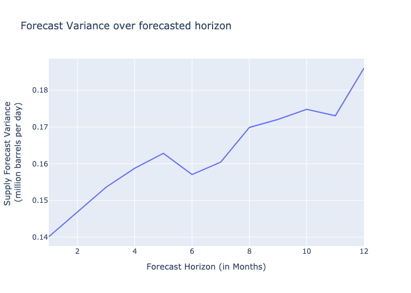

# EIA Data Analysis Assignments

## Assignment 1: STEO Data Analysis

### Downloading Data
```
cd assignment_part1
python download_EIA_data.py
```
Data Source: [EIA STEO Outlook](https://www.eia.gov/outlooks/steo/outlook.php)<br>
The function ```save_excel_files``` takes input argument ```years``` a list of years to download mentioned year's data.The downloaded data is stored in ```EIA_Excel_Files``` folder.

## Preprocessing
```python preprocess_EIA_data.py```<br>
```preprocess_EIA_data.py``` reads all downloaded files present in ```EIA_Excel_Files``` folder and save them into ```processed``` folder. Processed data has columns ds (as date), values, and a 0/1 flag to know if the data is forecast (1) or actual (0).<br>
Sample of Processed data:
| ds (date) | values| flag (0=actual, 1=forecast) |
| ------- | ------- | ------- |
| 2023-01-01 | xx | 0 |
| 2023-02-01 | xx | 1 |
| 2023-03-01 | xx | 1 |

## Analysis & Visualization
Jupyter notebook file 
```analysis_EIA_data.ipynb``` 
contains full analysis with plots (also a pdf version of the same ```.ipynb``` is added to the github repo for viewing embedded plots without running code).

## Key Findings:

### Highlights of analysis
 <br>
**Above Image shows that the variance increases with forecast horizon**
<br>
 <br>
**Image shows the Plot of December 2024 Forecasts Over Time with Actual value.**

### Range of deviation for dec 2024 forecast
| Min | Max| Mean | Median | Actual value |
| ------- | ------- | ------- |------- |------- |
| 12.80489 | 13.62401| 13.3296 | 13.41812 | 13.490543 |

### Average monthly Deviation: 0.226 (million barrels per day)
 <br>
Plot shows Average monthly deviation for each forecasting horizon and the deviation increases with forecast horizon.

### boxplot of monthly deviation for each forecast horizon
 <br>
Above image shows the boxplot of monthly deviation with varying forecast horizon.

### Line plot showing each forecasting iteration
 <br>
<br><br>
And the './summary_table.csv' shows the overall summary in a tabular format with dates as (Jan 23, Feb 23.. format) 
<br><br>
## Assignment 2: STEO Data Analysis
### Downloading data 
data source: https://www.eia.gov/dnav/pet/pet_pnp_inpt_dc_nus_mbbl_m.htm

```python download_EIA_dnav_monthly_data.py ```<br>
Above command will download the required data into folder ```"NetInput_RefineryBlender”```.<br>

### Analysis and plots
Analysis is done in a jupyter notebook ```“analysis_EIA_data_MonthlyVsWeekly.ipynb”```. A pdf version of the same is also added to github repository to view embeded plots.<br>
### Data loading and variables
DataFrame ```data_mn``` and ```data_wk``` are monthly and weekly dataFrame respectively. Also the units of these two are not the same. Weekly dataframe column ```"WCRRIUS2”``` is oil production has a unit of ```“thousand barrels per day”``` whereas the monthly dataframe has production data in column ```“MCRRIUS1”``` in ```“thousand barrels”```. **Therefore the weekly data needs to be multiplied by 7 (number of days in a week) to get the total number of barrels per week**. <br>
Also week and month overlap is handled as asked and overlapping weeks production is distributed to respectibe months.

### Weekly aggregated data to calculator monthly data
Weekly data is aggregated (ensuring the overlapping weeks is calculated as asked).

### Monthly deviation 
The monthly deviation is calculated using below formulae.<br>
```Deviation = Monthly (MCRRIUS1) - Monthly (obtained from weekly WCRRIUS2)```

### Monthly Deviation values
Below Table shows the results
| Min | -34781.0 thousand barrels|
| ------- | ------- |
| max | 253913.0 thousand barrels|
| median | 131.0 thousand barrels|
| mean | 1428.935166994106 thousand barrels|

 <br>
Above plot shows comparison of ```“monthly from weekly data"``` against ```“monthly data”```. The plot is mathing quite well hence validating correctness of the calculation.

## Q: Use the more timely weekly data to estimate the lagged monthly data. (Train a logisticRegression model)
A model is trained on weekly data to predict the monthly data. Below features were created and used training model.<br><br>
Below Tables showing input features and target for prediction/estimation model.
### Input features 
| WCRRIUS2 | week's production in thousand barrels per day |
| ------- | ------- |
| month | month number (1-12) |
| WeekStartDay | on which day of month the current week started |
| days_in_month | number of days in the current month |

### TARGET for prediction
| MCRRIUS1 | Our target to estimate monthly Production "in thousand barrels" |
| ------- | ------- |

## Model training
A linearRegression model is trained with above feastures as input and validated on 20% of test data. Model evaluation is done on metrices ```R-square```, ```root mean square error``` and ```mean average error```. The R-squared value for test data is 0.88 that means 88% of variance is explained by the model.

### tables showing evaluation on test data

|(test) Root Mean Squared Error.:    | 12593.48 thousand barrels |
| ------- | ------- |
|(test) Mean Average Error.:         | 8514.60 thousand barrels |
|(test) R-squared:                   | 0.88 |


